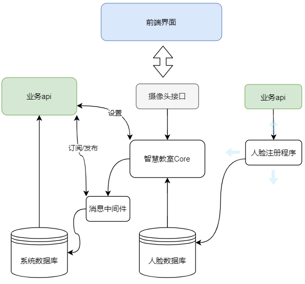

# 智慧教室Java

[智慧教室项目](https://github.com/hongyaohongyao/smart_classroom)的Java版本，尝试将多人姿态估计、情绪识别、人脸识别、静默活体检测等技术在java上实现。

## 项目环境

- java 1.8
- Deep Java Library 0.12.0-SNAPSHOT
- 更多详见pom.xml文件

## TODO

- [x] AlphaPose多人姿态估计
- [x] 轻量化AlphaPose的SPPE
- [x] 组合[LPN](https://github.com/zhang943/lpn-pytorch)和[轻量化人脸对齐](https://github.com/cunjian/pytorch_face_landmark)的轻量化全身姿态估计(86关键点)方法
- [x] 实时流水线处理框架
- [x] 多人姿态估计任务的ForkJoin并行处理
- [x] 课堂19种行为的识别（基于关键点的逻辑回归方法）
- [x] 头部姿态估计
- [x] rtmp视频推流
- [ ] 表情识别
- [ ] 面部疲劳检测
- [ ] 基于模糊综合分析的群体课堂专注度分析算法
- [ ] 人脸识别
- [ ] 前后端工程

## 系统设计

未完善

### 系统结构

- 业务api：通过springboot构建系统的网络接口
- 智慧教室Core：智慧教室系统的核心模块，通过设置和执行“任务方案”完成相关功能
- 任务方案：提供“课堂专注度分析”方案、“动态点名”方案和“作弊检测”方案，后期可提供定制化接口
  - 定时任务（可设置）、公共的任务参数、任务图（下一个任务的指针+执行模块指针）
- 执行模块: 封装一个抽象类，利用线程池提供异步的处理
- 智慧教室Core （流水线模式）

### 流水线处理模型

## 程序运行效果

Alphapose+动作分类，使用opencv进行播放

